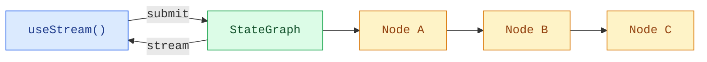

构建实时可视化 LangGraph 管道的前端。这些模式展示了如何渲染多步骤图执行，包括每个节点的状态和来自自定义 `StateGraph` 工作流的流式内容。

## 架构

LangGraph 图由通过边连接的命名节点组成。每个节点执行一个步骤（分类、研究、分析、综合）并将输出写入特定的状态键。在前端，`useStream` 提供对节点输出、流式令牌和图元数据的响应式访问，以便您可以将每个节点映射到 UI 卡片。



```python
from langgraph.graph import StateGraph, MessagesState, START, END

class State(MessagesState):
    classification: str
    research: str
    analysis: str

graph = StateGraph(State)
graph.add_node("classify", classify_node)
graph.add_node("research", research_node)
graph.add_node("analyze", analyze_node)
graph.add_edge(START, "classify")
graph.add_edge("classify", "research")
graph.add_edge("research", "analyze")
graph.add_edge("analyze", END)

app = graph.compile()
```


在前端，`useStream` 公开 `stream.values` 用于已完成的节点输出，以及 `getMessagesMetadata` 用于识别哪个节点产生了每个流式令牌。

```ts
import { useStream } from "@langchain/react";

function Pipeline() {
  const stream = useStream<typeof graph>({
    apiUrl: "http://localhost:2024",
    assistantId: "pipeline",
  });

  const classification = stream.values?.classification;
  const research = stream.values?.research;
  const analysis = stream.values?.analysis;
}
```

## 模式

<CardGroup cols={2}>
  <Card title="图执行" icon="chart-dots" href="/oss/python/langgraph/frontend/graph-execution">
    使用每个节点的状态和流式内容可视化多步骤图管道。
  </Card>
</CardGroup>

## 相关模式

[LangChain 前端模式](/oss/python/langchain/frontend/overview)——Markdown 消息、工具调用、乐观更新等——适用于任何 LangGraph 图。`useStream` 钩子提供相同的核心 API，无论您使用 `createAgent`、`createDeepAgent` 还是自定义的 `StateGraph`。

---

<div className="source-links">
<Callout icon="edit">
    [在 GitHub 上编辑此页面](https://github.com/langchain-ai/docs/edit/main/src/oss/langgraph/frontend/overview.md) 或 [提交问题](https://github.com/langchain-ai/docs/issues/new/choose)。
</Callout>
<Callout icon="terminal-2">
    [连接这些文档](/use-these-docs) 到 Claude、VSCode 等，通过 MCP 获取实时答案。
</Callout>
</div>
