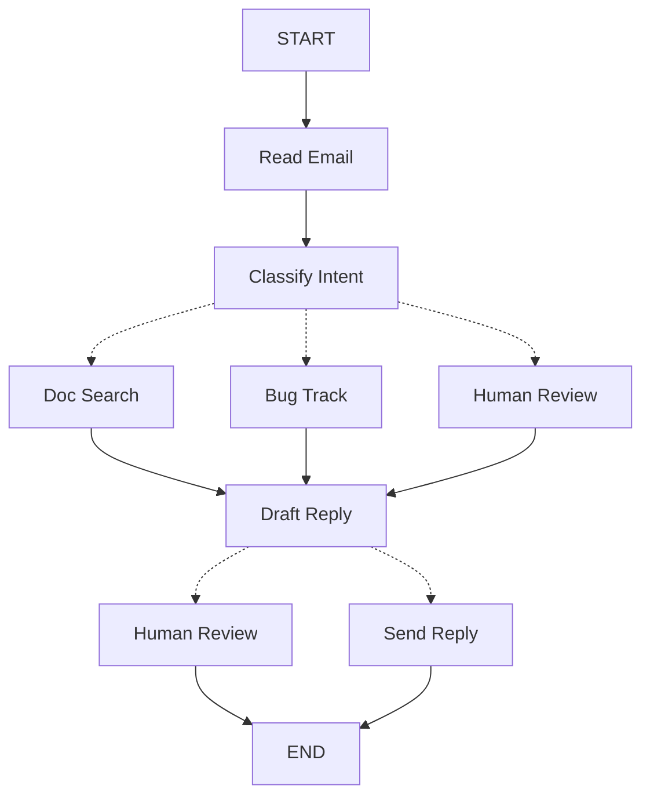

当你使用 LangGraph 构建 agent 时，首先需要将其拆分为称为**节点**的离散步骤。然后，你需要描述每个节点的不同决策和转换。最后，通过一个每个节点都可以读写的共享**状态**将节点连接在一起。

在本指南中，我们将引导你完成使用 LangGraph 构建客户支持邮件 agent 的思考过程。

## 从你想要自动化的流程开始

假设你需要构建一个处理客户支持邮件的 AI agent。你的产品团队给你以下需求：

```txt
The agent should:

- Read incoming customer emails
- Classify them by urgency and topic
- Search relevant documentation to answer questions
- Draft appropriate responses
- Escalate complex issues to human agents
- Schedule follow-ups when needed

Example scenarios to handle:

1. Simple product question: "How do I reset my password?"
2. Bug report: "The export feature crashes when I select PDF format"
3. Urgent billing issue: "I was charged twice for my subscription!"
4. Feature request: "Can you add dark mode to the mobile app?"
5. Complex technical issue: "Our API integration fails intermittently with 504 errors"
```

要在 LangGraph 中实现 agent，你通常会遵循相同的五个步骤。

## 步骤 1：将工作流映射为离散步骤

首先识别流程中的不同步骤。每个步骤将成为一个**节点**（执行特定任务的函数）。然后，勾画这些步骤如何相互连接。



图中的箭头显示可能的路径，但实际选择哪条路径的决策发生在每个节点内部。

现在我们已经确定了工作流中的组件，让我们了解每个节点需要做什么：

- `Read Email`：提取和解析邮件内容
- `Classify Intent`：使用 LLM 对紧急程度和主题进行分类，然后路由到适当的操作
- `Doc Search`：在知识库中查询相关信息
- `Bug Track`：在跟踪系统中创建或更新问题
- `Draft Reply`：生成适当的回复
- `Human Review`：升级到人工代理进行审批或处理
- `Send Reply`：发送邮件回复

<Tip>
注意，一些节点会决定下一步去哪里（`Classify Intent`、`Draft Reply`、`Human Review`），而其他节点总是进入相同的下一步（`Read Email` 总是进入 `Classify Intent`，`Doc Search` 总是进入 `Draft Reply`）。
</Tip>

## 步骤 2：确定每个步骤需要做什么

对于图中的每个节点，确定它代表什么类型的操作，以及它需要什么上下文才能正常工作。

<CardGroup cols={2}>
    <Card title="LLM 步骤" icon="brain" href="#llm-步骤">
        当需要理解、分析、生成文本或做出推理决策时使用
    </Card>
    <Card title="数据步骤" icon="database" href="#数据步骤">
        当需要从外部来源检索信息时使用
    </Card>
    <Card title="操作步骤" icon="bolt" href="#操作步骤">
        当需要执行外部操作时使用
    </Card>
    <Card title="用户输入步骤" icon="user" href="#用户输入步骤">
        当需要人工介入时使用
    </Card>
</CardGroup>

### LLM 步骤

当步骤需要理解、分析、生成文本或做出推理决策时：

<AccordionGroup>
    <Accordion title="分类意图">
        - 静态上下文（提示）：分类类别、紧急程度定义、响应格式
        - 动态上下文（来自状态）：邮件内容、发件人信息
        - 期望结果：决定路由的结构化分类
    </Accordion>

    <Accordion title="起草回复">
        - 静态上下文（提示）：语气指南、公司政策、响应模板
        - 动态上下文（来自状态）：分类结果、搜索结果、客户历史
        - 期望结果：准备好供审核的专业邮件回复
    </Accordion>
</AccordionGroup>

### 数据步骤

当步骤需要从外部来源检索信息时：

<AccordionGroup>
    <Accordion title="文档搜索">
        - 参数：从意图和主题构建的查询
        - 重试策略：是，对暂时性故障使用指数退避
        - 缓存：可以缓存常见查询以减少 API 调用
    </Accordion>

    <Accordion title="客户历史查询">
        - 参数：来自状态的客户邮箱或 ID
        - 重试策略：是，但如果不可用则回退到基本信息
        - 缓存：是，使用生存时间来平衡新鲜度和性能
    </Accordion>
</AccordionGroup>

### 操作步骤

当步骤需要执行外部操作时：

<AccordionGroup>
    <Accordion title="发送回复">
        - 何时执行节点：审批后（人工或自动）
        - 重试策略：是，对网络问题使用指数退避
        - 不应缓存：每次发送都是唯一操作
    </Accordion>

    <Accordion title="Bug 跟踪">
        - 何时执行节点：当意图为 "bug" 时始终执行
        - 重试策略：是，关键是不丢失 bug 报告
        - 返回：包含在响应中的工单 ID
    </Accordion>
</AccordionGroup>

### 用户输入步骤

当步骤需要人工介入时：

<AccordionGroup>
    <Accordion title="人工审核节点">
        - 决策上下文：原始邮件、回复草稿、紧急程度、分类
        - 预期输入格式：审批布尔值加可选的编辑后响应
        - 何时触发：高紧急程度、复杂问题或质量问题
    </Accordion>
</AccordionGroup>

## 步骤 3：设计状态

状态是 agent 中所有节点可访问的共享[记忆](/oss/python/concepts/memory)。把它想象成 agent 在处理流程时用来记录所学和所决定一切的笔记本。

### 什么属于状态？

对每条数据问自己这些问题：

<CardGroup cols={2}>
    <Card title="包含在状态中" icon="check">
        它需要在步骤间持久化吗？如果是，它就属于状态。
    </Card>

    <Card title="不存储" icon="code">
        你能从其他数据推导出它吗？如果是，在需要时计算而不是存储在状态中。
    </Card>
</CardGroup>

对于我们的邮件 agent，我们需要跟踪：

- 原始邮件和发件人信息（之后无法重建）
- 分类结果（多个后续/下游节点需要）
- 搜索结果和客户数据（重新获取成本高）
- 回复草稿（需要在审核过程中持久化）
- 执行元数据（用于调试和恢复）

### 保持状态原始，按需格式化提示

<Tip>
    关键原则：你的状态应该存储原始数据，而不是格式化的文本。在需要时在节点内格式化提示。
</Tip>

这种分离意味着：

- 不同节点可以根据需要以不同方式格式化相同数据
- 你可以更改提示模板而无需修改状态模式
- 调试更清晰——你可以准确看到每个节点接收的数据
- 你的 agent 可以在不破坏现有状态的情况下演进

让我们定义状态：

```python
from typing import TypedDict, Literal

# Define the structure for email classification
class EmailClassification(TypedDict):
    intent: Literal["question", "bug", "billing", "feature", "complex"]
    urgency: Literal["low", "medium", "high", "critical"]
    topic: str
    summary: str

class EmailAgentState(TypedDict):
    # Raw email data
    email_content: str
    sender_email: str
    email_id: str

    # Classification result
    classification: EmailClassification | None

    # Raw search/API results
    search_results: list[str] | None  # List of raw document chunks
    customer_history: dict | None  # Raw customer data from CRM

    # Generated content
    draft_response: str | None
    messages: list[str] | None
```


注意，状态只包含原始数据——没有提示模板，没有格式化字符串，没有指令。分类输出作为单个字典存储，直接来自 LLM。

## 步骤 4：构建节点

现在我们将每个步骤实现为函数。LangGraph 中的节点只是一个接收当前状态并返回更新的 Python 函数。


### 适当处理错误

不同的错误需要不同的处理策略：

| 错误类型 | 谁来修复 | 策略 | 何时使用 |
|----------|----------|------|----------|
| 暂时性错误（网络问题、速率限制） | 系统（自动） | 重试策略 | 通常在重试时解决的临时故障 |
| LLM 可恢复错误（工具故障、解析问题） | LLM | 在状态中存储错误并循环返回 | LLM 可以看到错误并调整方法 |
| 用户可修复错误（缺少信息、指令不清晰） | 人工 | 使用 `interrupt()` 暂停 | 需要用户输入才能继续 |
| 意外错误 | 开发者 | 让它们冒泡上升 | 需要调试的未知问题 |

<Tabs>
    <Tab title="暂时性错误" icon="rotate">
        添加重试策略以自动重试网络问题和速率限制：

    ```python
    from langgraph.types import RetryPolicy

    workflow.add_node(
        "search_documentation",
        search_documentation,
        retry_policy=RetryPolicy(max_attempts=3, initial_interval=1.0)
    )
    ```


    </Tab>

    <Tab title="LLM 可恢复" icon="brain">
        在状态中存储错误并循环返回，以便 LLM 可以看到出了什么问题并再试一次：

    ```python
    from langgraph.types import Command


    def execute_tool(state: State) -> Command[Literal["agent", "execute_tool"]]:
        try:
            result = run_tool(state['tool_call'])
            return Command(update={"tool_result": result}, goto="agent")
        except ToolError as e:
            # Let the LLM see what went wrong and try again
            return Command(
                update={"tool_result": f"Tool error: {str(e)}"},
                goto="agent"
            )
    ```


    </Tab>

    <Tab title="用户可修复" icon="user">
        在需要时暂停并从用户收集信息（如账户 ID、订单号或澄清）：

    ```python
    from langgraph.types import Command


    def lookup_customer_history(state: State) -> Command[Literal["draft_response"]]:
        if not state.get('customer_id'):
            user_input = interrupt({
                "message": "Customer ID needed",
                "request": "Please provide the customer's account ID to look up their subscription history"
            })
            return Command(
                update={"customer_id": user_input['customer_id']},
                goto="lookup_customer_history"
            )
        # Now proceed with the lookup
        customer_data = fetch_customer_history(state['customer_id'])
        return Command(update={"customer_history": customer_data}, goto="draft_response")
    ```


    </Tab>

    <Tab title="意外" icon="triangle-exclamation">
        让它们冒泡上升以便调试。不要捕获你无法处理的错误：

    ```python
    def send_reply(state: EmailAgentState):
        try:
            email_service.send(state["draft_response"])
        except Exception:
            raise  # Surface unexpected errors
    ```


    </Tab>
</Tabs>

### 实现我们的邮件 agent 节点

我们将把每个节点实现为简单函数。记住：节点接收状态，执行工作，并返回更新。

<AccordionGroup>
    <Accordion title="读取和分类节点" icon="brain">

    ```python
    from typing import Literal
    from langgraph.graph import StateGraph, START, END
    from langgraph.types import interrupt, Command, RetryPolicy
    from langchain_openai import ChatOpenAI
    from langchain.messages import HumanMessage

    llm = ChatOpenAI(model="gpt-5-nano")

    def read_email(state: EmailAgentState) -> dict:
        """Extract and parse email content"""
        # In production, this would connect to your email service
        return {
            "messages": [HumanMessage(content=f"Processing email: {state['email_content']}")]
        }

    def classify_intent(state: EmailAgentState) -> Command[Literal["search_documentation", "human_review", "draft_response", "bug_tracking"]]:
        """Use LLM to classify email intent and urgency, then route accordingly"""

        # Create structured LLM that returns EmailClassification dict
        structured_llm = llm.with_structured_output(EmailClassification)

        # Format the prompt on-demand, not stored in state
        classification_prompt = f"""
        Analyze this customer email and classify it:

        Email: {state['email_content']}
        From: {state['sender_email']}

        Provide classification including intent, urgency, topic, and summary.
        """

        # Get structured response directly as dict
        classification = structured_llm.invoke(classification_prompt)

        # Determine next node based on classification
        if classification['intent'] == 'billing' or classification['urgency'] == 'critical':
            goto = "human_review"
        elif classification['intent'] in ['question', 'feature']:
            goto = "search_documentation"
        elif classification['intent'] == 'bug':
            goto = "bug_tracking"
        else:
            goto = "draft_response"

        # Store classification as a single dict in state
        return Command(
            update={"classification": classification},
            goto=goto
        )
    ```


    </Accordion>

    <Accordion title="搜索和跟踪节点" icon="database">

    ```python
    def search_documentation(state: EmailAgentState) -> Command[Literal["draft_response"]]:
        """Search knowledge base for relevant information"""

        # Build search query from classification
        classification = state.get('classification', {})
        query = f"{classification.get('intent', '')} {classification.get('topic', '')}"

        try:
            # Implement your search logic here
            # Store raw search results, not formatted text
            search_results = [
                "Reset password via Settings > Security > Change Password",
                "Password must be at least 12 characters",
                "Include uppercase, lowercase, numbers, and symbols"
            ]
        except SearchAPIError as e:
            # For recoverable search errors, store error and continue
            search_results = [f"Search temporarily unavailable: {str(e)}"]

        return Command(
            update={"search_results": search_results},  # Store raw results or error
            goto="draft_response"
        )

    def bug_tracking(state: EmailAgentState) -> Command[Literal["draft_response"]]:
        """Create or update bug tracking ticket"""

        # Create ticket in your bug tracking system
        ticket_id = "BUG-12345"  # Would be created via API

        return Command(
            update={
                "search_results": [f"Bug ticket {ticket_id} created"],
                "current_step": "bug_tracked"
            },
            goto="draft_response"
        )
    ```


    </Accordion>

    <Accordion title="响应节点" icon="pen-to-square">

    ```python
    def draft_response(state: EmailAgentState) -> Command[Literal["human_review", "send_reply"]]:
        """Generate response using context and route based on quality"""

        classification = state.get('classification', {})

        # Format context from raw state data on-demand
        context_sections = []

        if state.get('search_results'):
            # Format search results for the prompt
            formatted_docs = "\n".join([f"- {doc}" for doc in state['search_results']])
            context_sections.append(f"Relevant documentation:\n{formatted_docs}")

        if state.get('customer_history'):
            # Format customer data for the prompt
            context_sections.append(f"Customer tier: {state['customer_history'].get('tier', 'standard')}")

        # Build the prompt with formatted context
        draft_prompt = f"""
        Draft a response to this customer email:
        {state['email_content']}

        Email intent: {classification.get('intent', 'unknown')}
        Urgency level: {classification.get('urgency', 'medium')}

        {chr(10).join(context_sections)}

        Guidelines:
        - Be professional and helpful
        - Address their specific concern
        - Use the provided documentation when relevant
        """

        response = llm.invoke(draft_prompt)

        # Determine if human review needed based on urgency and intent
        needs_review = (
            classification.get('urgency') in ['high', 'critical'] or
            classification.get('intent') == 'complex'
        )

        # Route to appropriate next node
        goto = "human_review" if needs_review else "send_reply"

        return Command(
            update={"draft_response": response.content},  # Store only the raw response
            goto=goto
        )

    def human_review(state: EmailAgentState) -> Command[Literal["send_reply", END]]:
        """Pause for human review using interrupt and route based on decision"""

        classification = state.get('classification', {})

        # interrupt() must come first - any code before it will re-run on resume
        human_decision = interrupt({
            "email_id": state.get('email_id',''),
            "original_email": state.get('email_content',''),
            "draft_response": state.get('draft_response',''),
            "urgency": classification.get('urgency'),
            "intent": classification.get('intent'),
            "action": "Please review and approve/edit this response"
        })

        # Now process the human's decision
        if human_decision.get("approved"):
            return Command(
                update={"draft_response": human_decision.get("edited_response", state.get('draft_response',''))},
                goto="send_reply"
            )
        else:
            # Rejection means human will handle directly
            return Command(update={}, goto=END)

    def send_reply(state: EmailAgentState) -> dict:
        """Send the email response"""
        # Integrate with email service
        print(f"Sending reply: {state['draft_response'][:100]}...")
        return {}
    ```


    </Accordion>
</AccordionGroup>

## 步骤 5：连接起来

现在我们将节点连接成一个工作图。由于我们的节点处理自己的路由决策，我们只需要几个基本的边。

要使用 `interrupt()` 启用[人工介入](/oss/python/langgraph/interrupts)，我们需要使用[检查点器](/oss/python/langgraph/persistence)进行编译以在运行之间保存状态：

<Accordion title="图编译代码" icon="diagram-project" defaultOpen={true}>

```python
from langgraph.checkpoint.memory import MemorySaver
from langgraph.types import RetryPolicy

# Create the graph
workflow = StateGraph(EmailAgentState)

# Add nodes with appropriate error handling
workflow.add_node("read_email", read_email)
workflow.add_node("classify_intent", classify_intent)

# Add retry policy for nodes that might have transient failures
workflow.add_node(
    "search_documentation",
    search_documentation,
    retry_policy=RetryPolicy(max_attempts=3)
)
workflow.add_node("bug_tracking", bug_tracking)
workflow.add_node("draft_response", draft_response)
workflow.add_node("human_review", human_review)
workflow.add_node("send_reply", send_reply)

# Add only the essential edges
workflow.add_edge(START, "read_email")
workflow.add_edge("read_email", "classify_intent")
workflow.add_edge("send_reply", END)

# Compile with checkpointer for persistence, in case run graph with Local_Server --> Please compile without checkpointer
memory = MemorySaver()
app = workflow.compile(checkpointer=memory)
```


</Accordion>

图结构很简洁，因为路由发生在节点内部通过 [`Command`](https://reference.langchain.com/python/langgraph/types/#langgraph.types.Command) 对象。每个节点使用类型提示如 `Command[Literal["node1", "node2"]]` 声明它可以去哪里，使流程明确且可追踪。


### 试用你的 agent

让我们用一个需要人工审核的紧急账单问题运行我们的 agent：

<Accordion title="测试 agent" icon="flask">

```python
# Test with an urgent billing issue
initial_state = {
    "email_content": "I was charged twice for my subscription! This is urgent!",
    "sender_email": "customer@example.com",
    "email_id": "email_123",
    "messages": []
}

# Run with a thread_id for persistence
config = {"configurable": {"thread_id": "customer_123"}}
result = app.invoke(initial_state, config)
# The graph will pause at human_review
print(f"human review interrupt:{result['__interrupt__']}")

# When ready, provide human input to resume
from langgraph.types import Command

human_response = Command(
    resume={
        "approved": True,
        "edited_response": "We sincerely apologize for the double charge. I've initiated an immediate refund..."
    }
)

# Resume execution
final_result = app.invoke(human_response, config)
print(f"Email sent successfully!")
```


</Accordion>

图在遇到 `interrupt()` 时暂停，将所有内容保存到检查点器，然后等待。它可以在几天后恢复，从中断的地方继续。`thread_id` 确保此对话的所有状态都保存在一起。

## 总结和后续步骤

### 关键见解

构建这个邮件 agent 向我们展示了 LangGraph 的思维方式：

<CardGroup cols={2}>
    <Card title="分解为离散步骤" icon="sitemap" href="#步骤-1将工作流映射为离散步骤">
        每个节点做好一件事。这种分解可以实现流式进度更新、可暂停和恢复的持久执行，以及清晰的调试，因为你可以检查步骤之间的状态。
    </Card>

    <Card title="状态是共享记忆" icon="database" href="#步骤-3设计状态">
        存储原始数据，而不是格式化的文本。这让不同节点可以以不同方式使用相同的信息。
    </Card>

    <Card title="节点是函数" icon="code" href="#步骤-4构建节点">
        它们接收状态，执行工作，并返回更新。当它们需要做路由决策时，它们同时指定状态更新和下一个目的地。
    </Card>

    <Card title="错误是流程的一部分" icon="triangle-exclamation" href="#适当处理错误">
        暂时性故障获得重试，LLM 可恢复错误带上下文循环返回，用户可修复问题暂停等待输入，意外错误冒泡上升以便调试。
    </Card>

    <Card title="人工输入是一等公民" icon="user" href="/oss/python/langgraph/interrupts">
        `interrupt()` 函数无限期暂停执行，保存所有状态，并在你提供输入时从中断处恢复。当与节点中的其他操作结合时，它必须放在最前面。
    </Card>

    <Card title="图结构自然涌现" icon="diagram-project" href="#步骤-5连接起来">
        你定义基本连接，你的节点处理它们自己的路由逻辑。这使控制流明确且可追踪——你可以通过查看当前节点始终了解 agent 接下来会做什么。
    </Card>
</CardGroup>

### 高级考虑

<Accordion title="节点粒度权衡" icon="sliders">
<Info>
本节探讨节点粒度设计中的权衡。大多数应用程序可以跳过此部分，使用上面展示的模式。
</Info>

你可能会想：为什么不把 `Read Email` 和 `Classify Intent` 合并为一个节点？

或者为什么要把 Doc Search 和 Draft Reply 分开？

答案涉及弹性和可观测性之间的权衡。

**弹性考虑：** LangGraph 的[持久执行](/oss/python/langgraph/durable-execution)在节点边界创建检查点。当工作流在中断或故障后恢复时，它从执行停止的节点开始处重新开始。较小的节点意味着更频繁的检查点，这意味着如果出问题需要重复的工作更少。如果你将多个操作合并到一个大节点中，接近结尾处的故障意味着从该节点的开头重新执行所有内容。

我们为邮件 agent 选择这种分解的原因：

- **隔离外部服务：** Doc Search 和 Bug Track 是单独的节点，因为它们调用外部 API。如果搜索服务很慢或失败，我们希望将其与 LLM 调用隔离。我们可以为这些特定节点添加重试策略而不影响其他节点。

- **中间可见性：** 将 `Classify Intent` 作为自己的节点让我们可以在采取行动之前检查 LLM 决定了什么。这对调试和监控很有价值——你可以准确看到 agent 何时以及为何路由到人工审核。

- **不同的故障模式：** LLM 调用、数据库查询和邮件发送有不同的重试策略。单独的节点让你可以独立配置这些。

- **可重用性和测试：** 较小的节点更容易单独测试并在其他工作流中重用。

另一种有效的方法：你可以将 `Read Email` 和 `Classify Intent` 合并为单个节点。你会失去在分类之前检查原始邮件的能力，并且在该节点的任何故障时都会重复这两个操作。对于大多数应用程序，单独节点的可观测性和调试优势值得这种权衡。

应用程序级别的考虑：步骤 2 中的缓存讨论（是否缓存搜索结果）是应用程序级别的决策，而不是 LangGraph 框架功能。你根据具体需求在节点函数中实现缓存——LangGraph 不规定这一点。

性能考虑：更多节点并不意味着更慢的执行。LangGraph 默认在后台写入检查点（[异步持久模式](/oss/python/langgraph/durable-execution#durability-modes)），因此你的图继续运行而不等待检查点完成。这意味着你可以获得频繁的检查点而性能影响最小。你可以根据需要调整此行为——使用 `"exit"` 模式仅在完成时进行检查点，或使用 `"sync"` 模式阻塞执行直到每个检查点写入完成。
</Accordion>

### 接下来去哪里

这是关于如何思考使用 LangGraph 构建 agent 的介绍。你可以用以下内容扩展这个基础：

<CardGroup cols={2}>
    <Card title="人工介入模式" icon="user-check" href="/oss/python/langgraph/interrupts">
        了解如何在执行前添加工具审批、批量审批和其他模式
    </Card>

    <Card title="子图" icon="diagram-nested" href="/oss/python/langgraph/use-subgraphs">
        为复杂的多步骤操作创建子图
    </Card>

    <Card title="流式传输" icon="tower-broadcast" href="/oss/python/langgraph/streaming">
        添加流式传输以向用户显示实时进度
    </Card>

    <Card title="可观测性" icon="chart-line" href="/oss/python/langgraph/observability">
        使用 LangSmith 添加可观测性以进行调试和监控
    </Card>

    <Card title="工具集成" icon="wrench" href="/oss/python/langchain/tools">
        集成更多工具用于网络搜索、数据库查询和 API 调用
    </Card>

    <Card title="重试逻辑" icon="rotate" href="/oss/python/langgraph/use-graph-api#add-retry-policies">
        为失败操作实现带指数退避的重试逻辑
    </Card>
</CardGroup>

---

<Callout icon="pen-to-square" iconType="regular">
    [Edit this page on GitHub](https://github.com/langchain-ai/docs/edit/main/src/oss/langgraph/thinking-in-langgraph.mdx) or [file an issue](https://github.com/langchain-ai/docs/issues/new/choose).
</Callout>
<Tip icon="terminal" iconType="regular">
    [Connect these docs](/use-these-docs) to Claude, VSCode, and more via MCP for real-time answers.
</Tip>
<div class='fixed right-2 bg-white bottom-2'></div>