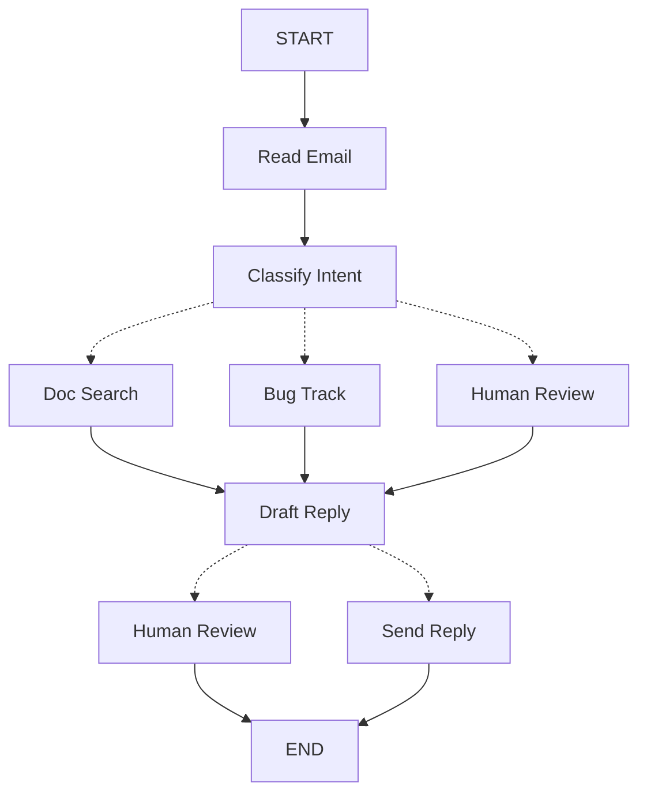

使用 LangGraph 构建智能体时，你首先需要将其分解为称为**节点**的离散步骤。然后，描述每个节点之间的不同决策和转换。最后，通过每个节点都可以读取和写入的共享**状态**将节点连接在一起。

在本演练中，我们将引导你完成使用 LangGraph 构建客户支持电子邮件智能体的思维过程。

## 从你想自动化的流程开始

想象你需要构建一个处理客户支持电子邮件的 AI 智能体。你的产品团队给了你这些要求：

```txt
The agent should:

- Read incoming customer emails
- Classify them by urgency and topic
- Search relevant documentation to answer questions
- Draft appropriate responses
- Escalate complex issues to human agents
- Schedule follow-ups when needed

Example scenarios to handle:

1. Simple product question: "How do I reset my password?"
2. Bug report: "The export feature crashes when I select PDF format"
3. Urgent billing issue: "I was charged twice for my subscription!"
4. Feature request: "Can you add dark mode to the mobile app?"
5. Complex technical issue: "Our API integration fails intermittently with 504 errors"
```

要在 LangGraph 中实现智能体，你通常会遵循相同的五个步骤。

## 步骤 1：将工作流映射为离散步骤

首先识别流程中的不同步骤。每个步骤都将成为一个**节点**（执行一个特定操作的函数）。然后，绘制这些步骤彼此如何连接。



此图表中的箭头显示可能的路径，但决定采取哪条路径的实际决定发生在每个节点内部。

现在我们已经确定了工作流中的组件，让我们理解每个节点需要做什么：

- `读取电子邮件`：提取并解析电子邮件内容
- `分类意图`：使用 LLM 对紧急程度和主题进行分类，然后路由到适当的操作
- `文档搜索`：在知识库中查询相关信息
- `错误追踪`：在跟踪系统中创建或更新问题
- `起草回复`：生成适当的回复
- `人工审查`：升级给人类代理进行批准或处理
- `发送回复`：分发电子邮件回复

<Tip>
  注意，某些节点做出关于下一步去哪里的决策（`分类意图`、`起草回复`、`人工审查`），而其他节点总是进行相同的下一步（`读取电子邮件`总是进入`分类意图`，`文档搜索`总是进入`起草回复`）。
</Tip>

## 步骤 2：确定每个步骤需要做什么

对于图中的每个节点，确定它代表什么类型的操作以及它需要什么上下文才能正常工作。

<CardGroup cols={2}>
  <Card title="LLM steps" icon="brain" href="#llm-steps">
    Use when you need to understand, analyze, generate text, or make reasoning
    decisions
  </Card>
  <Card title="Data steps" icon="database" href="#data-steps">
    Use when you need to retrieve information from external sources
  </Card>
  <Card title="Action steps" icon="bolt" href="#action-steps">
    Use when you need to perform external actions
  </Card>
  <Card title="User input steps" icon="user" href="#user-input-steps">
    Use when you need human intervention
  </Card>
</CardGroup>

### LLM steps

When a step needs to understand, analyze, generate text, or make reasoning decisions:

<AccordionGroup>
    <Accordion title="Classify intent">
        - Static context (prompt): Classification categories, urgency definitions, response format
        - Dynamic context (from state): Email content, sender information
        - Desired outcome: Structured classification that determines routing
    </Accordion>

    <Accordion title="Draft reply">
        - Static context (prompt): Tone guidelines, company policies, response templates
        - Dynamic context (from state): Classification results, search results, customer history
        - Desired outcome: Professional email response ready for review
    </Accordion>

</AccordionGroup>

### Data steps

When a step needs to retrieve information from external sources:

<AccordionGroup>
    <Accordion title="Document search">
        - Parameters: Query built from intent and topic
        - Retry strategy: Yes, with exponential backoff for transient failures
        - Caching: Could cache common queries to reduce API calls
    </Accordion>

    <Accordion title="Customer history lookup">
        - Parameters: Customer email or ID from state
        - Retry strategy: Yes, but with fallback to basic info if unavailable
        - Caching: Yes, with time-to-live to balance freshness and performance
    </Accordion>

</AccordionGroup>

### Action steps

When a step needs to perform an external action:

<AccordionGroup>
    <Accordion title="Send reply">
        - When to execute node: After approval (human or automated)
        - Retry strategy: Yes, with exponential backoff for network issues
        - Should not cache: Each send is a unique action
    </Accordion>

    <Accordion title="Bug track">
        - When to execute node: Always when intent is "bug"
        - Retry strategy: Yes, critical to not lose bug reports
        - Returns: Ticket ID to include in response
    </Accordion>

</AccordionGroup>

### User input steps

When a step needs human intervention:

<AccordionGroup>
  <Accordion title="Human review node">
    - Context for decision: Original email, draft response, urgency,
    classification - Expected input format: Approval boolean plus optional
    edited response - When triggered: High urgency, complex issues, or quality
    concerns
  </Accordion>
</AccordionGroup>

## 步骤 3：设计你的状态

状态是智能体中所有节点都可以访问的共享[内存](/oss/python/concepts/memory)。把它想象成智能体用来记录它在整个流程中学到和决定的一切的笔记本。

### 什么应该在状态中？

问自己关于每一条数据的这些问题：

<CardGroup cols={2}>
    <Card title="Include in state" icon="check">
        Does it need to persist across steps? If yes, it goes in state.
    </Card>

    <Card title="Don't store" icon="code">
        Can you derive it from other data? If yes, compute it when needed instead of storing it in state.
    </Card>

</CardGroup>

对于我们的电子邮件智能体，我们需要跟踪：

- 原始电子邮件和发件人信息（之后无法重建这些）
- 分类结果（由多个后续节点需要）
- 搜索结果和客户数据（重新获取成本高）
- 草稿回复（需要在审查过程中持久化）
- 执行元数据（用于调试和恢复）

### 保持状态原始，按需格式化提示

<Tip>
  关键原则：你的状态应该存储原始数据，而不是格式化的文本。在需要时在节点内格式化提示。
</Tip>

这种分离意味着：

- 不同的节点可以以不同的方式格式化相同的数据
- 你可以更改提示模板而不修改状态模式
- 调试更清晰 – 你可以看到每个节点接收的确切数据
- 你的智能体可以演进而不破坏现有状态

让我们定义我们的状态：

```python
from typing import TypedDict, Literal

# Define the structure for email classification
class EmailClassification(TypedDict):
    intent: Literal["question", "bug", "billing", "feature", "complex"]
    urgency: Literal["low", "medium", "high", "critical"]
    topic: str
    summary: str

class EmailAgentState(TypedDict):
    # Raw email data
    email_content: str
    sender_email: str
    email_id: str

    # Classification result
    classification: EmailClassification | None

    # Raw search/API results
    search_results: list[str] | None  # List of raw document chunks
    customer_history: dict | None  # Raw customer data from CRM

    # Generated content
    draft_response: str | None
    messages: list[str] | None
```

Notice that the state contains only raw data – no prompt templates, no formatted strings, no instructions. The classification output is stored as a single dictionary, straight from the LLM.

## 步骤 4：构建你的节点

现在我们将每个步骤实现为一个函数。LangGraph 中的节点就是一个 Python 函数，它接受当前状态并返回其更新。

### 适当处理错误

不同的错误需要不同的处理策略：

| 错误类型                                 | 谁修复       | 策略                         | 何时使用                     |
| ---------------------------------------- | ------------ | ---------------------------- | ---------------------------- |
| 临时错误（网络问题、速率限制）           | 系统（自动） | 重试策略                     | 通常通过重试解决的临时故障   |
| LLM 可恢复错误（工具故障、解析问题）     | LLM          | 将错误存储在状态中并循环返回 | LLM 可以看到错误并调整其方法 |
| 用户可修复错误（缺少信息、不清楚的说明） | 人工         | 使用 `interrupt()` 暂停      | 需要用户输入才能继续         |
| 意外错误                                 | 开发者       | 让它们冒泡                   | 需要调试的未知问题           |

<Tabs>
    <Tab title="临时错误" icon="rotate">
        添加重试策略以自动重试网络问题和速率限制：

    ```python
    from langgraph.types import RetryPolicy

    workflow.add_node(
        "search_documentation",
        search_documentation,
        retry_policy=RetryPolicy(max_attempts=3, initial_interval=1.0)
    )
    ```


    </Tab>

    <Tab title="LLM 可恢复" icon="brain">
        将错误存储在状态中并循环返回，这样 LLM 可以看到出了什么问题并重试：

    ```python
    from langgraph.types import Command


    def execute_tool(state: State) -> Command[Literal["agent", "execute_tool"]]:
        try:
            result = run_tool(state['tool_call'])
            return Command(update={"tool_result": result}, goto="agent")
        except ToolError as e:
            # Let the LLM see what went wrong and try again
            return Command(
                update={"tool_result": f"Tool error: {str(e)}"},
                goto="agent"
            )
    ```


    </Tab>

    <Tab title="用户可修复" icon="user">
        在需要时暂停并从用户处收集信息（如账户 ID、订单号或澄清）：

    ```python
    from langgraph.types import Command


    def lookup_customer_history(state: State) -> Command[Literal["draft_response"]]:
        if not state.get('customer_id'):
            user_input = interrupt({
                "message": "Customer ID needed",
                "request": "Please provide the customer's account ID to look up their subscription history"
            })
            return Command(
                update={"customer_id": user_input['customer_id']},
                goto="lookup_customer_history"
            )
        # Now proceed with the lookup
        customer_data = fetch_customer_history(state['customer_id'])
        return Command(update={"customer_history": customer_data}, goto="draft_response")
    ```


    </Tab>

    <Tab title="意外错误" icon="alert-triangle">
        让它们冒泡以进行调试。不要捕获你无法处理的错误：

    ```python
    def send_reply(state: EmailAgentState):
        try:
            email_service.send(state["draft_response"])
        except Exception:
            raise  # Surface unexpected errors
    ```


    </Tab>

</Tabs>

### 实现我们的电子邮件智能体节点

我们将每个节点实现为一个简单函数。记住：节点接受状态、做工作并返回更新。

<AccordionGroup>
    <Accordion title="读取和分类节点" icon="brain">

    ```python
    from typing import Literal
    from langgraph.graph import StateGraph, START, END
    from langgraph.types import interrupt, Command, RetryPolicy
    from langchain_openai import ChatOpenAI
    from langchain.messages import HumanMessage

    llm = ChatOpenAI(model="gpt-5-nano")

    def read_email(state: EmailAgentState) -> dict:
        """Extract and parse email content"""
        # In production, this would connect to your email service
        return {
            "messages": [HumanMessage(content=f"Processing email: {state['email_content']}")]
        }

    def classify_intent(state: EmailAgentState) -> Command[Literal["search_documentation", "human_review", "draft_response", "bug_tracking"]]:
        """Use LLM to classify email intent and urgency, then route accordingly"""

        # Create structured LLM that returns EmailClassification dict
        structured_llm = llm.with_structured_output(EmailClassification)

        # Format the prompt on-demand, not stored in state
        classification_prompt = f"""
        Analyze this customer email and classify it:

        Email: {state['email_content']}
        From: {state['sender_email']}

        Provide classification including intent, urgency, topic, and summary.
        """

        # Get structured response directly as dict
        classification = structured_llm.invoke(classification_prompt)

        # Determine next node based on classification
        if classification['intent'] == 'billing' or classification['urgency'] == 'critical':
            goto = "human_review"
        elif classification['intent'] in ['question', 'feature']:
            goto = "search_documentation"
        elif classification['intent'] == 'bug':
            goto = "bug_tracking"
        else:
            goto = "draft_response"

        # Store classification as a single dict in state
        return Command(
            update={"classification": classification},
            goto=goto
        )
    ```


    </Accordion>

    <Accordion title="搜索和追踪节点" icon="database">

    ```python
    def search_documentation(state: EmailAgentState) -> Command[Literal["draft_response"]]:
        """Search knowledge base for relevant information"""

        # Build search query from classification
        classification = state.get('classification', {})
        query = f"{classification.get('intent', '')} {classification.get('topic', '')}"

        try:
            # Implement your search logic here
            # Store raw search results, not formatted text
            search_results = [
                "Reset password via Settings > Security > Change Password",
                "Password must be at least 12 characters",
                "Include uppercase, lowercase, numbers, and symbols"
            ]
        except SearchAPIError as e:
            # For recoverable search errors, store error and continue
            search_results = [f"Search temporarily unavailable: {str(e)}"]

        return Command(
            update={"search_results": search_results},  # Store raw results or error
            goto="draft_response"
        )

    def bug_tracking(state: EmailAgentState) -> Command[Literal["draft_response"]]:
        """Create or update bug tracking ticket"""

        # Create ticket in your bug tracking system
        ticket_id = "BUG-12345"  # Would be created via API

        return Command(
            update={
                "search_results": [f"Bug ticket {ticket_id} created"],
                "current_step": "bug_tracked"
            },
            goto="draft_response"
        )
    ```


    </Accordion>

    <Accordion title="响应节点" icon="edit">

    ```python
    def draft_response(state: EmailAgentState) -> Command[Literal["human_review", "send_reply"]]:
        """Generate response using context and route based on quality"""

        classification = state.get('classification', {})

        # Format context from raw state data on-demand
        context_sections = []

        if state.get('search_results'):
            # Format search results for the prompt
            formatted_docs = "\n".join([f"- {doc}" for doc in state['search_results']])
            context_sections.append(f"Relevant documentation:\n{formatted_docs}")

        if state.get('customer_history'):
            # Format customer data for the prompt
            context_sections.append(f"Customer tier: {state['customer_history'].get('tier', 'standard')}")

        # Build the prompt with formatted context
        draft_prompt = f"""
        Draft a response to this customer email:
        {state['email_content']}

        Email intent: {classification.get('intent', 'unknown')}
        Urgency level: {classification.get('urgency', 'medium')}

        {chr(10).join(context_sections)}

        Guidelines:
        - Be professional and helpful
        - Address their specific concern
        - Use the provided documentation when relevant
        """

        response = llm.invoke(draft_prompt)

        # Determine if human review needed based on urgency and intent
        needs_review = (
            classification.get('urgency') in ['high', 'critical'] or
            classification.get('intent') == 'complex'
        )

        # Route to appropriate next node
        goto = "human_review" if needs_review else "send_reply"

        return Command(
            update={"draft_response": response.content},  # Store only the raw response
            goto=goto
        )

    def human_review(state: EmailAgentState) -> Command[Literal["send_reply", END]]:
        """Pause for human review using interrupt and route based on decision"""

        classification = state.get('classification', {})

        # interrupt() must come first - any code before it will re-run on resume
        human_decision = interrupt({
            "email_id": state.get('email_id',''),
            "original_email": state.get('email_content',''),
            "draft_response": state.get('draft_response',''),
            "urgency": classification.get('urgency'),
            "intent": classification.get('intent'),
            "action": "Please review and approve/edit this response"
        })

        # Now process the human's decision
        if human_decision.get("approved"):
            return Command(
                update={"draft_response": human_decision.get("edited_response", state.get('draft_response',''))},
                goto="send_reply"
            )
        else:
            # Rejection means human will handle directly
            return Command(update={}, goto=END)

    def send_reply(state: EmailAgentState) -> dict:
        """Send the email response"""
        # Integrate with email service
        print(f"Sending reply: {state['draft_response'][:100]}...")
        return {}
    ```


    </Accordion>

</AccordionGroup>

## 步骤 5：将其连接在一起

现在我们将节点连接到工作图中。由于我们的节点处理自己的路由决定，我们只需要几条基本边。

要启用具有 `interrupt()` 的[人工介入](/oss/python/langgraph/interrupts)，我们需要用[检查点](/oss/python/langgraph/persistence)编译以在运行之间保存状态：

<Accordion title="图编译代码" icon="sitemap" defaultOpen={true}>

```python
from langgraph.checkpoint.memory import MemorySaver
from langgraph.types import RetryPolicy

# Create the graph
workflow = StateGraph(EmailAgentState)

# Add nodes with appropriate error handling
workflow.add_node("read_email", read_email)
workflow.add_node("classify_intent", classify_intent)

# Add retry policy for nodes that might have transient failures
workflow.add_node(
    "search_documentation",
    search_documentation,
    retry_policy=RetryPolicy(max_attempts=3)
)
workflow.add_node("bug_tracking", bug_tracking)
workflow.add_node("draft_response", draft_response)
workflow.add_node("human_review", human_review)
workflow.add_node("send_reply", send_reply)

# Add only the essential edges
workflow.add_edge(START, "read_email")
workflow.add_edge("read_email", "classify_intent")
workflow.add_edge("send_reply", END)

# Compile with checkpointer for persistence, in case run graph with Local_Server --> Please compile without checkpointer
memory = MemorySaver()
app = workflow.compile(checkpointer=memory)
```

</Accordion>

The graph structure is minimal because routing happens inside nodes through [`Command`](https://reference.langchain.com/python/langgraph/types/Command) objects. Each node declares where it can go using type hints like `Command[Literal["node1", "node2"]]`, making the flow explicit and traceable.

### 尝试你的智能体

让我们用需要人工审查的紧急账单问题运行我们的智能体：

<Accordion title="测试智能体" icon="flask">

```python
# Test with an urgent billing issue
initial_state = {
    "email_content": "I was charged twice for my subscription! This is urgent!",
    "sender_email": "customer@example.com",
    "email_id": "email_123",
    "messages": []
}

# Run with a thread_id for persistence
config = {"configurable": {"thread_id": "customer_123"}}
result = app.invoke(initial_state, config)
# The graph will pause at human_review
print(f"human review interrupt:{result['__interrupt__']}")

# When ready, provide human input to resume
from langgraph.types import Command

human_response = Command(
    resume={
        "approved": True,
        "edited_response": "We sincerely apologize for the double charge. I've initiated an immediate refund..."
    }
)

# Resume execution
final_result = app.invoke(human_response, config)
print(f"Email sent successfully!")
```

</Accordion>

The graph pauses when it hits `interrupt()`, saves everything to the checkpointer, and waits. It can resume days later, picking up exactly where it left off. The `thread_id` ensures all state for this conversation is preserved together.

## 总结和后续步骤

### 关键洞察

构建这个电子邮件智能体展示了我们 LangGraph 的思维方式：

<CardGroup cols={2}>
    <Card title="分解为离散步骤" icon="sitemap" href="#step-1-map-out-your-workflow-as-discrete-steps">
        每个节点做好一件事。这种分解能够进行流式进度更新、可以暂停和恢复的持久执行，以及清晰的调试，因为你可以检查步骤之间的状态。
    </Card>

    <Card title="状态是共享内存" icon="database" href="#step-3-design-your-state">
        存储原始数据，而不是格式化的文本。这让不同的节点能够以不同的方式使用相同的信息。
    </Card>

    <Card title="节点是函数" icon="code" href="#step-4-build-your-nodes">
        它们接受状态、做工作并返回更新。当它们需要做路由决定时，它们指定状态更新和下一个目标。
    </Card>

    <Card title="错误是流的一部分" icon="alert-triangle" href="#handle-errors-appropriately">
        临时故障获得重试，LLM 可恢复错误带着上下文循环返回，用户可修复的问题暂停等待输入，意外错误冒泡以进行调试。
    </Card>

    <Card title="人工输入是一等公民" icon="user" href="/oss/python/langgraph/interrupts">
        `interrupt()` 函数无限期暂停执行、保存所有状态，并在你提供输入时恰好从中断的地方恢复。当与节点中的其他操作结合时，它必须首先出现。
    </Card>

    <Card title="图结构自然出现" icon="sitemap" href="#step-5-wire-it-together">
        你定义基本连接，你的节点处理自己的路由逻辑。这保持控制流明确和可追踪 - 你总是可以通过查看当前节点来理解你的智能体接下来会做什么。
    </Card>

</CardGroup>

### 高级考虑

<Accordion title="节点粒度权衡" icon="adjustments">
<Info>
本部分探讨节点粒度设计中的权衡。大多数应用可以跳过此部分并使用上面显示的模式。
</Info>

你可能想知道：为什么不将`读取电子邮件`和`分类意图`组合成一个节点？

或者为什么要将文档搜索与起草回复分开？

答案涉及复原力和可观察性之间的权衡。

**复原力考虑：** LangGraph 的[持久执行](/oss/python/langgraph/durable-execution)在节点边界处创建检查点。当工作流在中断或故障后恢复时，它从执行停止的节点的开始处开始。较小的节点意味着更频繁的检查点，这意味着如果出现问题，需要重复的工作更少。如果你将多个操作组合到一个大节点中，靠近结尾的故障意味着从该节点的开始处重新执行所有内容。

我们为电子邮件智能体选择这种分解的原因：

- **外部服务隔离：** 文档搜索和错误追踪是单独的节点，因为它们调用外部 API。如果搜索服务缓慢或失败，我们希望将其与 LLM 调用隔离。我们可以向这些特定节点添加重试策略，而不影响其他节点。

- **中间可见性：** 拥有`分类意图`作为其自己的节点让我们在采取行动之前检查 LLM 决定的内容。这对于调试和监控很有价值 — 你可以看到智能体何时以及为什么路由到人工审查。

- **不同的故障模式：** LLM 调用、数据库查询和电子邮件发送有不同的重试策略。单独的节点让你可以独立配置这些。

- **可重用性和测试：** 较小的节点更容易单独测试和在其他工作流中重用。

一个不同的有效方法：你可以将`读取电子邮件`和`分类意图`组合成单个节点。你会失去在分类前检查原始电子邮件的能力，并会在该节点中的任何故障时重复这两个操作。对于大多数应用，单独节点的可观察性和调试优势值得权衡。

应用级关注：步骤 2 中的缓存讨论（是否缓存搜索结果）是应用级决定，而不是 LangGraph 框架功能。你根据具体要求在节点函数内实现缓存 — LangGraph 不规定这一点。

性能考虑：更多节点并不意味着执行速度更慢。LangGraph 默认在后台写入检查点（[异步持久性模式](/oss/python/langgraph/durable-execution#durability-modes)），因此你的图继续运行而无需等待检查点完成。这意味着你获得频繁的检查点，性能影响最小。如果需要，你可以调整此行为 — 使用 `"exit"` 模式仅在完成时检查点，或 `"sync"` 模式阻止执行直到每个检查点写入。

</Accordion>

### 接下来去哪里

这是关于如何思考使用 LangGraph 构建智能体的简介。你可以用以下内容扩展此基础：

<CardGroup cols={2}>
    <Card title="人工介入模式" icon="user-check" href="/oss/python/langgraph/interrupts">
        学习如何在执行前添加工具批准、批量批准和其他模式
    </Card>

    <Card title="子图" icon="hierarchy" href="/oss/python/langgraph/use-subgraphs">
        为复杂的多步操作创建子图
    </Card>

    <Card title="流式传输" icon="broadcast" href="/oss/python/langgraph/streaming">
        添加流式传输以向用户显示实时进度
    </Card>

    <Card title="可观察性" icon="chart-line" href="/oss/python/langgraph/observability">
        使用 LangSmith 添加可观察性以进行调试和监控
    </Card>

    <Card title="工具集成" icon="tool" href="/oss/python/langchain/tools">
        集成更多工具用于网络搜索、数据库查询和 API 调用
    </Card>

    <Card title="重试逻辑" icon="rotate" href="/oss/python/langgraph/use-graph-api#add-retry-policies">
        为失败的操作实现指数退避重试逻辑
    </Card>

</CardGroup>

---

<div className="source-links">
  <Callout icon="edit">
    [在 GitHub
    上编辑此页面](https://github.com/langchain-ai/docs/edit/main/src/oss/langgraph/thinking-in-langgraph.mdx)
    或 [提交问题](https://github.com/langchain-ai/docs/issues/new/choose)。
  </Callout>
  <Callout icon="terminal-2">
    通过 MCP 将[这些文档](/use-these-docs)连接到 Claude、VSCode
    等，获取实时答案。
  </Callout>
</div>
