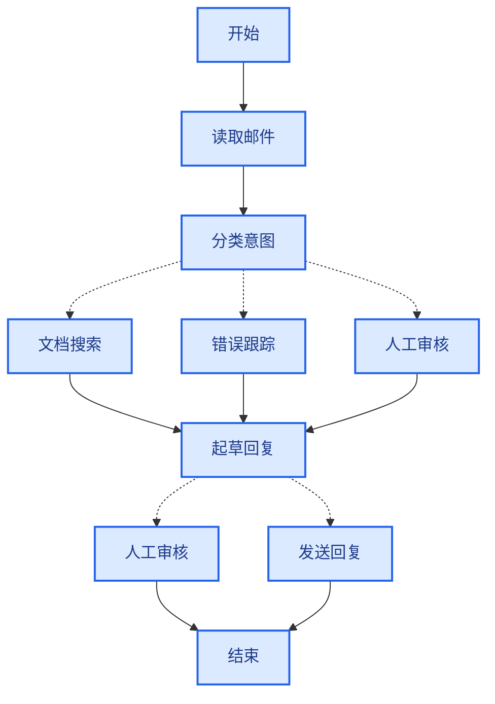

当您使用 LangGraph 构建智能体时，您首先会将其分解为离散的步骤，称为**节点**。然后，您将描述每个节点的不同决策和转换。最后，您通过一个共享的**状态**将节点连接起来，每个节点都可以从中读取和写入。

在本指南中，我们将引导您完成使用 LangGraph 构建客户支持邮件智能体的思维过程。

## 从您想要自动化的过程开始

想象您需要构建一个处理客户支持邮件的 AI 智能体。您的产品团队给出了以下要求：

```txt
智能体应该：

- 读取收到的客户邮件
- 按紧急程度和主题对邮件进行分类
- 搜索相关文档以回答问题
- 起草适当的回复
- 将复杂问题升级给人工坐席
- 在需要时安排后续跟进

要处理的示例场景：

1. 简单的产品问题：“我如何重置密码？”
2. 错误报告：“当我选择 PDF 格式时，导出功能会崩溃”
3. 紧急计费问题：“我的订阅被重复收费了！”
4. 功能请求：“您能在移动应用中添加深色模式吗？”
5. 复杂的技术问题：“我们的 API 集成偶尔会因 504 错误而失败”
```

要在 LangGraph 中实现智能体，您通常需要遵循以下五个步骤。

## 步骤 1：将您的工作流程映射为离散步骤

首先识别您流程中的不同步骤。每个步骤将成为一个**节点**（一个执行特定功能的函数）。然后，草拟这些步骤如何相互连接。



此图中的箭头显示了可能的路径，但实际选择哪条路径的决策发生在每个节点内部。

现在我们已经识别了工作流程中的组件，让我们了解每个节点需要做什么：

- `读取邮件`：提取和解析邮件内容
- `分类意图`：使用 LLM 对紧急程度和主题进行分类，然后路由到适当的操作
- `文档搜索`：查询您的知识库以获取相关信息
- `错误跟踪`：在跟踪系统中创建或更新问题
- `起草回复`：生成适当的回复
- `人工审核`：升级给人工坐席以进行批准或处理
- `发送回复`：发送邮件回复

<Tip>
请注意，有些节点会决定下一步去哪里（`分类意图`、`起草回复`、`人工审核`），而其他节点总是进行到相同的下一步（`读取邮件` 总是转到 `分类意图`，`文档搜索` 总是转到 `起草回复`）。
</Tip>

## 步骤 2：确定每个步骤需要做什么

对于图中的每个节点，确定它代表什么类型的操作以及它需要什么上下文才能正常工作。

<CardGroup cols={2}>
    <Card title="LLM 步骤" icon="brain" href="#llm-steps">
        当您需要理解、分析、生成文本或做出推理决策时使用
    </Card>
    <Card title="数据步骤" icon="database" href="#data-steps">
        当您需要从外部源检索信息时使用
    </Card>
    <Card title="操作步骤" icon="bolt" href="#action-steps">
        当您需要执行外部操作时使用
    </Card>
    <Card title="用户输入步骤" icon="user" href="#user-input-steps">
        当您需要人工干预时使用
    </Card>
</CardGroup>

### LLM 步骤

当一个步骤需要理解、分析、生成文本或做出推理决策时：

<AccordionGroup>
    <Accordion title="分类意图">
        - 静态上下文（提示）：分类类别、紧急程度定义、回复格式
        - 动态上下文（来自状态）：邮件内容、发件人信息
        - 期望结果：结构化的分类，用于确定路由
    </Accordion>

    <Accordion title="起草回复">
        - 静态上下文（提示）：语气指南、公司政策、回复模板
        - 动态上下文（来自状态）：分类结果、搜索结果、客户历史
        - 期望结果：可供审核的专业邮件回复
    </Accordion>
</AccordionGroup>

### 数据步骤

当一个步骤需要从外部源检索信息时：

<AccordionGroup>
    <Accordion title="文档搜索">
        - 参数：根据意图和主题构建的查询
        - 重试策略：是，对临时故障使用指数退避
        - 缓存：可以缓存常见查询以减少 API 调用
    </Accordion>

    <Accordion title="客户历史记录查询">
        - 参数：来自状态的客户电子邮件或 ID
        - 重试策略：是，但如果不可用则回退到基本信息
        - 缓存：是，使用生存时间以平衡新鲜度和性能
    </Accordion>
</AccordionGroup>

### 操作步骤

当一个步骤需要执行外部操作时：

<AccordionGroup>
    <Accordion title="发送回复">
        - 何时执行节点：批准后（人工或自动）
        - 重试策略：是，对网络问题使用指数退避
        - 不应缓存：每次发送都是唯一操作
    </Accordion>

    <Accordion title="错误跟踪">
        - 何时执行节点：当意图是“错误”时总是执行
        - 重试策略：是，对于不丢失错误报告至关重要
        - 返回：包含在回复中的工单 ID
    </Accordion>
</AccordionGroup>

### 用户输入步骤

当一个步骤需要人工干预时：

<AccordionGroup>
    <Accordion title="人工审核节点">
        - 决策上下文：原始邮件、草稿回复、紧急程度、分类
        - 期望输入格式：批准布尔值加上可选的编辑回复
        - 何时触发：高紧急程度、复杂问题或质量问题
    </Accordion>
</AccordionGroup>

## 步骤 3：设计您的状态

状态是智能体中所有节点都可以访问的共享[内存](/oss/python/concepts/memory)。可以将其视为智能体用来跟踪其在处理过程中学习和决定的一切内容的笔记本。

### 什么属于状态？

关于每个数据片段，问自己这些问题：

<CardGroup cols={2}>
    <Card title="包含在状态中" icon="check">
        它需要跨步骤持久化吗？如果是，则放入状态。
    </Card>

    <Card title="不存储" icon="code">
        您可以从其他数据推导出它吗？如果是，则在需要时计算它，而不是将其存储在状态中。
    </Card>
</CardGroup>

对于我们的邮件智能体，我们需要跟踪：

- 原始邮件和发件人信息（以后无法重建）
- 分类结果（后续/下游节点需要）
- 搜索结果和客户数据（重新获取成本高）
- 草稿回复（需要在审核过程中持久化）
- 执行元数据（用于调试和恢复）

### 保持状态原始，按需格式化提示

<Tip>
    一个关键原则：您的状态应存储原始数据，而不是格式化文本。在需要时在节点内格式化提示。
</Tip>

这种分离意味着：

- 不同的节点可以根据其需求以不同方式格式化相同的数据
- 您可以更改提示模板而无需修改状态架构
- 调试更清晰——您可以看到每个节点收到的确切数据
- 您的智能体可以在不破坏现有状态的情况下演进

让我们定义我们的状态：

```python
from typing import TypedDict, Literal

# 定义邮件分类的结构
class EmailClassification(TypedDict):
    intent: Literal["question", "bug", "billing", "feature", "complex"]
    urgency: Literal["low", "medium", "high", "critical"]
    topic: str
    summary: str

class EmailAgentState(TypedDict):
    # 原始邮件数据
    email_content: str
    sender_email: str
    email_id: str

    # 分类结果
    classification: EmailClassification | None

    # 原始搜索/API 结果
    search_results: list[str] | None  # 原始文档块列表
    customer_history: dict | None  # 来自 CRM 的原始客户数据

    # 生成的内容
    draft_response: str | None
    messages: list[str] | None
```


请注意，状态仅包含原始数据——没有提示模板、没有格式化字符串、没有指令。分类输出作为单个字典存储，直接来自 LLM。

## 步骤 4：构建您的节点

现在我们将每个步骤实现为一个函数。LangGraph 中的节点只是一个 Python 函数，它接受当前状态并返回对其的更新。


### 适当处理错误

不同的错误需要不同的处理策略：

| 错误类型 | 修复者 | 策略 | 使用时机 |
|------------|--------------|----------|-------------|
| 临时错误（网络问题、速率限制） | 系统（自动） | 重试策略 | 通常重试后会解决的临时故障 |
| LLM 可恢复错误（工具故障、解析问题） | LLM | 将错误存储在状态中并循环返回 | LLM 可以看到错误并调整其方法 |
| 用户可修复错误（缺少信息、指令不明确） | 人工 | 使用 `interrupt()` 暂停 | 需要用户输入才能继续 |
| 意外错误 | 开发人员 | 让它们冒泡 | 需要调试的未知问题 |

<Tabs>
    <Tab title="临时错误" icon="rotate">
        添加重试策略以自动重试网络问题和速率限制：

    ```python
    from langgraph.types import RetryPolicy

    workflow.add_node(
        "search_documentation",
        search_documentation,
        retry_policy=RetryPolicy(max_attempts=3, initial_interval=1.0)
    )
    ```


    </Tab>

    <Tab title="LLM 可恢复" icon="brain">
        将错误存储在状态中并循环返回，以便 LLM 可以看到出了什么问题并重试：

    ```python
    from langgraph.types import Command


    def execute_tool(state: State) -> Command[Literal["agent", "execute_tool"]]:
        try:
            result = run_tool(state['tool_call'])
            return Command(update={"tool_result": result}, goto="agent")
        except ToolError as e:
            # 让 LLM 看到出了什么问题并重试
            return Command(
                update={"tool_result": f"Tool error: {str(e)}"},
                goto="agent"
            )
    ```


    </Tab>

    <Tab title="用户可修复" icon="user">
        在需要时暂停并从用户收集信息（如帐户 ID、订单号或澄清）：

    ```python
    from langgraph.types import Command


    def lookup_customer_history(state: State) -> Command[Literal["draft_response"]]:
        if not state.get('customer_id'):
            user_input = interrupt({
                "message": "Customer ID needed",
                "request": "Please provide the customer's account ID to look up their subscription history"
            })
            return Command(
                update={"customer_id": user_input['customer_id']},
                goto="lookup_customer_history"
            )
        # 现在继续进行查找
        customer_data = fetch_customer_history(state['customer_id'])
        return Command(update={"customer_history": customer_data}, goto="draft_response")
    ```


    </Tab>

    <Tab title="意外" icon="alert-triangle">
        让它们冒泡以进行调试。不要捕获您无法处理的内容：

    ```python
    def send_reply(state: EmailAgentState):
        try:
            email_service.send(state["draft_response"])
        except Exception:
            raise  # 显示意外错误
    ```


    </Tab>
</Tabs>


### 实现我们的邮件智能体节点

我们将每个节点实现为一个简单的函数。记住：节点接受状态，执行工作，并返回更新。

<AccordionGroup>
    <Accordion title="读取和分类节点" icon="brain">

    ```python
    from typing import Literal
    from langgraph.graph import StateGraph, START, END
    from langgraph.types import interrupt, Command, RetryPolicy
    from langchain_openai import ChatOpenAI
    from langchain.messages import HumanMessage

    llm = ChatOpenAI(model="gpt-5-nano")

    def read_email(state: EmailAgentState) -> dict:
        """提取和解析邮件内容"""
        # 在生产环境中，这将连接到您的电子邮件服务
        return {
            "messages": [HumanMessage(content=f"Processing email: {state['email_content']}")]
        }

    def classify_intent(state: EmailAgentState) -> Command[Literal["search_documentation", "human_review", "draft_response", "bug_tracking"]]:
        """使用 LLM 对邮件意图和紧急程度进行分类，然后相应地路由"""

        # 创建返回 EmailClassification 字典的结构化 LLM
        structured_llm = llm.with_structured_output(EmailClassification)

        # 按需格式化提示，不存储在状态中
        classification_prompt = f"""
        分析此客户邮件并对其进行分类：

        邮件：{state['email_content']}
        来自：{state['sender_email']}

        提供分类，包括意图、紧急程度、主题和摘要。
        """

        # 直接获取结构化响应作为字典
        classification = structured_llm.invoke(classification_prompt)

        # 根据分类确定下一个节点
        if classification['intent'] == 'billing' or classification['urgency'] == 'critical':
            goto = "human_review"
        elif classification['intent'] in ['question', 'feature']:
            goto = "search_documentation"
        elif classification['intent'] == 'bug':
            goto = "bug_tracking"
        else:
            goto = "draft_response"

        # 将分类作为单个字典存储在状态中
        return Command(
            update={"classification": classification},
            goto=goto
        )
    ```


    </Accordion>

    <Accordion title="搜索和跟踪节点" icon="database">

    ```python
    def search_documentation(state: EmailAgentState) -> Command[Literal["draft_response"]]:
        """搜索知识库以获取相关信息"""

        # 根据分类构建搜索查询
        classification = state.get('classification', {})
        query = f"{classification.get('intent', '')} {classification.get('topic', '')}"

        try:
            # 在此处实现您的搜索逻辑
            # 存储原始搜索结果，而不是格式化文本
            search_results = [
                "通过设置 > 安全 > 更改密码重置密码",
                "密码必须至少 12 个字符",
                "包括大写、小写、数字和符号"
            ]
        except SearchAPIError as e:
            # 对于可恢复的搜索错误，存储错误并继续
            search_results = [f"Search temporarily unavailable: {str(e)}"]

        return Command(
            update={"search_results": search_results},  # 存储原始结果或错误
            goto="draft_response"
        )

    def bug_tracking(state: EmailAgentState) -> Command[Literal["draft_response"]]:
        """创建或更新错误跟踪工单"""

        # 在您的错误跟踪系统中创建工单
        ticket_id = "BUG-12345"  # 将通过 API 创建

        return Command(
            update={
                "search_results": [f"Bug ticket {ticket_id} created"],
                "current_step": "bug_tracked"
            },
            goto="draft_response"
        )
    ```


    </Accordion>

    <Accordion title="回复节点" icon="edit">

    ```python
    def draft_response(state: EmailAgentState) -> Command[Literal["human_review", "send_reply"]]:
        """使用上下文生成回复，并根据质量进行路由"""

        classification = state.get('classification', {})

        # 按需从原始状态数据格式化上下文
        context_sections = []

        if state.get('search_results'):
            # 为提示格式化搜索结果
            formatted_docs = "\n".join([f"- {doc}" for doc in state['search_results']])
            context_sections.append(f"Relevant documentation:\n{formatted_docs}")

        if state.get('customer_history'):
            # 为提示格式化客户数据
            context_sections.append(f"Customer tier: {state['customer_history'].get('tier', 'standard')}")

        # 使用格式化上下文构建提示
        draft_prompt = f"""
        起草对此客户邮件的回复：
        {state['email_content']}

        邮件意图：{classification.get('intent', 'unknown')}
        紧急程度：{classification.get('urgency', 'medium')}

        {chr(10).join(context_sections)}

        指南：
        - 专业且乐于助人
        - 解决他们的具体问题
        - 在相关时使用提供的文档
        """

        response = llm.invoke(draft_prompt)

        # 根据紧急程度和意图确定是否需要人工审核
        needs_review = (
            classification.get('urgency') in ['high', 'critical'] or
            classification.get('intent') == 'complex'
        )

        # 路由到适当的下一个节点
        goto = "human_review" if needs_review else "send_reply"

        return Command(
            update={"draft_response": response.content},  # 仅存储原始回复
            goto=goto
        )

    def human_review(state: EmailAgentState) -> Command[Literal["send_reply", END]]:
        """使用中断暂停以进行人工审核，并根据决策进行路由"""

        classification = state.get('classification', {})

        # interrupt() 必须首先出现 - 它之前的任何代码都将在恢复时重新运行
        human_decision = interrupt({
            "email_id": state.get('email_id',''),
            "original_email": state.get('email_content',''),
            "draft_response": state.get('draft_response',''),
            "urgency": classification.get('urgency'),
            "intent": classification.get('intent'),
            "action": "Please review and approve/edit this response"
        })

        # 现在处理人工决策
        if human_decision.get("approved"):
            return Command(
                update={"draft_response": human_decision.get("edited_response", state.get('draft_response',''))},
                goto="send_reply"
            )
        else:
            # 拒绝意味着人工将直接处理
            return Command(update={}, goto=END)

    def send_reply(state: EmailAgentState) -> dict:
        """发送邮件回复"""
        # 与电子邮件服务集成
        print(f"Sending reply: {state['draft_response'][:100]}...")
        return {}
    ```


    </Accordion>
</AccordionGroup>

## 步骤 5：将其连接在一起

现在我们将节点连接成一个工作图。由于我们的节点处理自己的路由决策，我们只需要一些基本的边。

要使用 `interrupt()` 启用[人机协作](/oss/python/langgraph/interrupts)，我们需要使用[检查点](/oss/python/langgraph/persistence)进行编译，以在运行之间保存状态：

<Accordion title="图编译代码" icon="sitemap" defaultOpen={true}>

```python
from langgraph.checkpoint.memory import MemorySaver
from langgraph.types import RetryPolicy

# 创建图
workflow = StateGraph(EmailAgentState)

# 添加具有适当错误处理的节点
workflow.add_node("read_email", read_email)
workflow.add_node("classify_intent", classify_intent)

# 为可能具有临时故障的节点添加重试策略
workflow.add_node(
    "search_documentation",
    search_documentation,
    retry_policy=RetryPolicy(max_attempts=3)
)
workflow.add_node("bug_tracking", bug_tracking)
workflow.add_node("draft_response", draft_response)
workflow.add_node("human_review", human_review)
workflow.add_node("send_reply", send_reply)

# 仅添加必要的边
workflow.add_edge(START, "read_email")
workflow.add_edge("read_email", "classify_intent")
workflow.add_edge("send_reply", END)

# 使用检查点进行编译以实现持久性，以防使用 Local_Server 运行图 --> 请在没有检查点的情况下编译
memory = MemorySaver()
app = workflow.compile(checkpointer=memory)
```


</Accordion>

图结构是最小的，因为路由通过 [`Command`](https://reference.langchain.com/python/langgraph/types/Command) 对象在节点内部发生。每个节点使用类型提示（如 `Command[Literal["node1", "node2"]]`）声明它可以去往的位置，使流程明确且可追踪。


### 试用您的智能体

让我们使用一个需要人工审核的紧急计费问题来运行我们的智能体：

<Accordion title="测试智能体" icon="flask">

```python
# 使用紧急计费问题进行测试
initial_state = {
    "email_content": "我的订阅被重复收费了！这很紧急！",
    "sender_email": "customer@example.com",
    "email_id": "email_123",
    "messages": []
}

# 使用 thread_id 运行以实现持久性
config = {"configurable": {"thread_id": "customer_123"}}
result = app.invoke(initial_state, config)
# 图将在 human_review 处暂停
print(f"human review interrupt:{result['__interrupt__']}")

# 准备好后，提供人工输入以恢复
from langgraph.types import Command

human_response = Command(
    resume={
        "approved": True,
        "edited_response": "我们为重复收费深表歉意。我已启动立即退款..."
    }
)

# 恢复执行
final_result = app.invoke(human_response, config)
print(f"Email sent successfully!")
```


</Accordion>

当图遇到 `interrupt()` 时，它会暂停，将所有内容保存到检查点，并等待。它可以在几天后恢复，从离开的地方继续。`thread_id` 确保此对话的所有状态都一起保存。

## 总结和后续步骤

### 关键见解

构建此邮件智能体向我们展示了 LangGraph 的思维方式：

<CardGroup cols={2}>
    <Card title="分解为离散步骤" icon="sitemap" href="#step-1-map-out-your-workflow-as-discrete-steps">
        每个节点都很好地完成一件事。这种分解支持流式传输进度更新、可暂停和恢复的持久执行，以及清晰的调试，因为您可以检查步骤之间的状态。
    </Card>

    <Card title="状态是共享内存" icon="database" href="#step-3-design-your-state">
        存储原始数据，而不是格式化文本。这允许不同的节点以不同的方式使用相同的信息。
    </Card>

    <Card title="节点是函数" icon="code" href="#step-4-build-your-nodes">
        它们接受状态，执行工作，并返回更新。当它们需要做出路由决策时，它们会指定状态更新和下一个目标。
    </Card>

    <Card title="错误是流程的一部分" icon="alert-triangle" href="#handle-errors-appropriately">
        临时故障会重试，LLM 可恢复错误会循环返回上下文，用户可修复的问题会暂停以等待输入，意外错误会冒泡以进行调试。
    </Card>

    <Card title="人工输入是一等公民" icon="user" href="/oss/python/langgraph/interrupts">
        `interrupt()` 函数会无限期暂停执行，保存所有状态，并在您提供输入时从离开的地方恢复。当与节点中的其他操作结合使用时，它必须首先出现。
    </Card>

    <Card title="图结构自然出现" icon="sitemap" href="#step-5-wire-it-together">
        您定义基本连接，您的节点处理自己的路由逻辑。这使控制流明确且可追踪——您总是可以通过查看当前节点来了解您的智能体下一步要做什么。
    </Card>
</CardGroup>

### 高级考虑因素

<Accordion title="节点粒度权衡" icon="adjustments">
<Info>
本节探讨节点粒度设计中的权衡。大多数应用程序可以跳过此部分并使用上面显示的模式。
</Info>

您可能想知道：为什么不将 `读取邮件` 和 `分类意图` 合并到一个节点中？

或者为什么将文档搜索与起草回复分开？

答案涉及弹性和可观察性之间的权衡。

**弹性考虑：** LangGraph 的[持久执行](/oss/python/langgraph/durable-execution)在节点边界创建检查点。当工作流在中断或故障后恢复时，它会从执行停止的节点的开头开始。较小的节点意味着更频繁的检查点，这意味着如果出现问题，需要重复的工作更少。如果您将多个操作合并到一个大节点中，靠近末尾的故障意味着从该节点的开头重新执行所有内容。

我们为邮件智能体选择这种分解的原因：

- **外部服务隔离：** 文档搜索和错误跟踪是单独的节点，因为它们调用外部 API。如果搜索服务速度慢或失败，我们希望将其与 LLM 调用隔离开来。我们可以向这些特定节点添加重试策略，而不会影响其他节点。

- **中间可见性：** 将 `分类意图` 作为其自己的节点，让我们可以在采取行动之前检查 LLM 的决定。这对于调试和监控很有价值——您可以准确看到智能体何时以及为何路由到人工审核。

- **不同的故障模式：** LLM 调用、数据库查找和电子邮件发送具有不同的重试策略。单独的节点允许您独立配置这些。

- **可重用性和测试：** 较小的节点更容易单独测试并在其他工作流中重用。

另一种有效的方法：您可以将 `读取邮件` 和 `分类意图` 合并到一个节点中。您将失去在分类前检查原始邮件的能力，并且在该节点中的任何故障都会重复这两个操作。对于大多数应用程序，单独节点的可观察性和调试优势值得权衡。

应用程序级别的考虑：步骤 2 中关于是否缓存搜索结果的讨论是应用程序级别的决策，而不是 LangGraph 框架功能。您根据特定需求在节点函数内实现缓存——LangGraph 不规定这一点。

性能考虑：更多的节点并不意味着执行速度更慢。LangGraph 默认在后台写入检查点（[异步持久模式](/oss/python/langgraph/durable-execution#durability-modes)），因此您的图会继续运行，而无需等待检查点完成。这意味着您可以在最小性能影响下获得频繁的检查点。如果需要，您可以调整此行为——使用 `"exit"` 模式仅在完成时检查点，或使用 `"sync"` 模式在每次检查点写入时阻止执行。
</Accordion>

### 后续步骤

这是关于使用 LangGraph 构建智能体的思维方式的介绍。您可以通过以下方式扩展此基础：

<CardGroup cols={2}>
    <Card title="人机协作模式" icon="user-check" href="/oss/python/langgraph/interrupts">
        学习如何在执行前添加工具批准、批量批准和其他模式
    </Card>

    <Card title="子图" icon="hierarchy" href="/oss/python/langgraph/use-subgraphs">
        为复杂的多步骤操作创建子图
    </Card>

    <Card title="流式传输" icon="broadcast" href="/oss/python/langgraph/streaming">
        添加流式传输以向用户显示实时进度
    </Card>

    <Card title="可观察性" icon="chart-line" href="/oss/python/langgraph/observability">
        使用 LangSmith 添加可观察性以进行调试和监控
    </Card>

    <Card title="工具集成" icon="tool" href="/oss/python/langchain/tools">
        集成更多工具以进行网络搜索、数据库查询和 API 调用
    </Card>

    <Card title="重试逻辑" icon="rotate" href="/oss/python/langgraph/use-graph-api#add-retry-policies">
        为失败的操作实现具有指数退避的重试逻辑
    </Card>
</CardGroup>

---

<div className="source-links">
<Callout icon="edit">
    [在 GitHub 上编辑此页面](https://github.com/langchain-ai/docs/edit/main/src/oss/langgraph/thinking-in-langgraph.mdx) 或[提交问题](https://github.com/langchain-ai/docs/issues/new/choose)。
</Callout>
<Callout icon="terminal-2">
    [通过 MCP 将这些文档](/use-these-docs)连接到 Claude、VSCode 等，以获取实时答案。
</Callout>
</div>